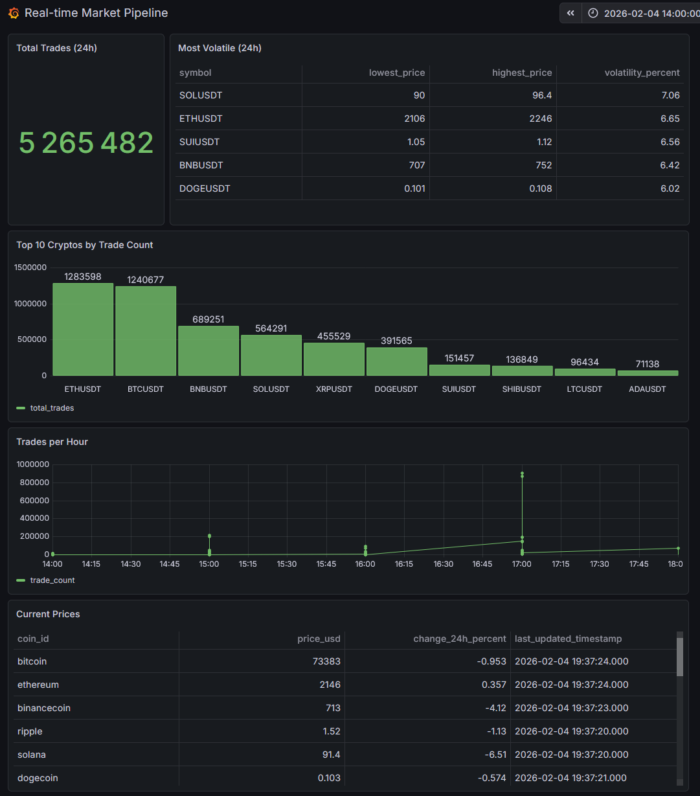
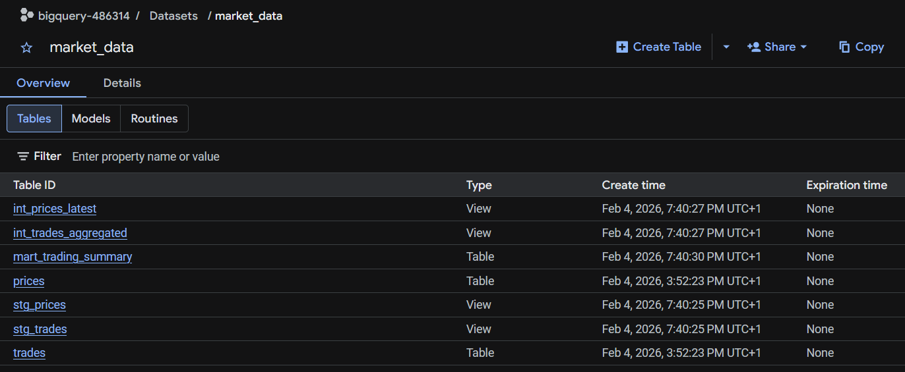
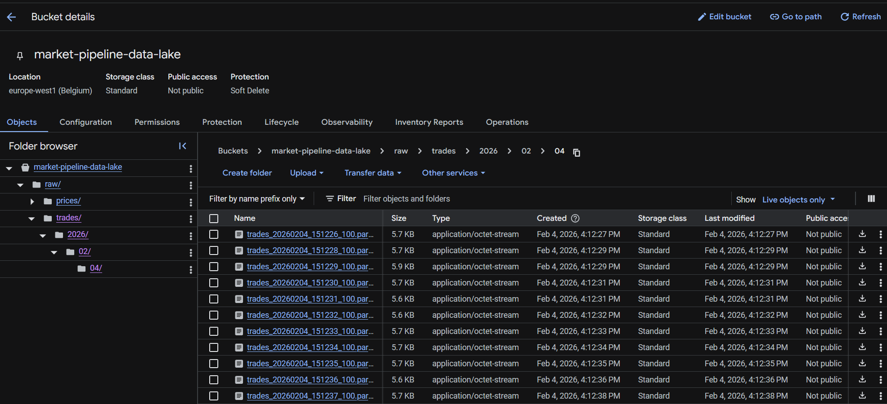
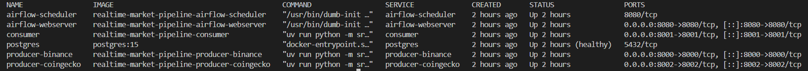

# Real-time Market Pipeline

[]()
[](https://python.org)
[](https://confluent.io)
[](https://cloud.google.com/bigquery)
[](https://getdbt.com)
[](https://airflow.apache.org)
[](https://grafana.com)

Production-grade real-time cryptocurrency market data pipeline with multi-source ingestion, stream processing, data warehouse, and live monitoring.

## 🔴 Live Dashboard

**[➡️ View Real-time Dashboard](https://cloudspawn.grafana.net/public-dashboards/39de7467de6e4ffd90d2605eda0a6999)**

Live data from Binance & CoinGecko, transformed by dbt, refreshed every 10 minutes.



## Architecture
```
┌─────────────────────────────────────────────────────────────────┐
│                         INGESTION                               │
├─────────────────────────────────────────────────────────────────┤
│  Binance WebSocket ──┐                                          │
│  (20 crypto pairs)   ├──▶ Kafka ──▶ market.trades.raw          │
│                      │                                          │
│  CoinGecko API ──────┘──▶ Kafka ──▶ market.prices.enriched     │
│  (market data)                                                  │
└─────────────────────────────────────────────────────────────────┘
                                 │
                                 ▼
┌─────────────────────────────────────────────────────────────────┐
│                         PROCESSING                              │
├─────────────────────────────────────────────────────────────────┤
│  Consumer ──▶ BigQuery (data warehouse)                        │
│          └──▶ GCS Parquet (data lake)                          │
│                                                                 │
│  Features: Batch inserts, Dead Letter Queue, Dual-write        │
└─────────────────────────────────────────────────────────────────┘
                                 │
                                 ▼
┌─────────────────────────────────────────────────────────────────┐
│                      TRANSFORMATION                             │
├─────────────────────────────────────────────────────────────────┤
│  Airflow ──▶ dbt run (every 10 min)                            │
│                 │                                               │
│                 ├── staging    (stg_trades, stg_prices)        │
│                 ├── intermediate (aggregations, latest)         │
│                 └── marts      (trading_summary)                │
└─────────────────────────────────────────────────────────────────┘
                                 │
                                 ▼
┌─────────────────────────────────────────────────────────────────┐
│                       MONITORING                                │
├─────────────────────────────────────────────────────────────────┤
│  Prometheus ◀── metrics (throughput, errors, connections)      │
│  Grafana Cloud ──▶ dashboards (BigQuery data)                  │
└─────────────────────────────────────────────────────────────────┘
```

## Features

### Data Pipeline
- **Multi-source ingestion**: Binance WebSocket (real-time trades) + CoinGecko API (market data)
- **20 cryptocurrencies**: BTC, ETH, SOL, ADA, DOT, AVAX, LINK, MATIC, XRP, BNB, DOGE, SHIB, LTC, ATOM, NEAR, APT, ARB, OP, INJ, SUI
- **Kafka streaming**: Multi-topic architecture with Confluent Cloud
- **Dual-write pattern**: BigQuery (analytics) + GCS Parquet (data lake)

### Orchestration
- **Airflow**: DAG scheduling with PostgreSQL backend
- **dbt**: Layered transformations (staging → intermediate → marts)
- **Docker Compose**: Full stack orchestration

### Production Patterns
- Retry with exponential backoff
- Graceful shutdown handling
- Dead Letter Queue for failed messages
- Prometheus metrics instrumentation
- Structured JSON logging

## Screenshots

| Component | Description |
|-----------|-------------|
|  | Airflow DAG with dbt runs |
|  | BigQuery tables and views |
|  | GCS Parquet data lake |
|  | Docker Compose services |

## Project Structure
```
realtime-market-pipeline/
├── src/
│   ├── producers/
│   │   ├── binance_ws.py         # WebSocket real-time trades
│   │   └── coingecko.py          # API polling market data
│   ├── consumers/
│   │   └── bigquery_consumer.py  # Dual-write BigQuery + GCS
│   └── common/
│       ├── config.py             # Pydantic settings
│       ├── logging.py            # Structured logging
│       ├── kafka_client.py       # Kafka producer wrapper
│       └── metrics.py            # Prometheus metrics
├── dbt/
│   ├── models/
│   │   ├── staging/              # stg_trades, stg_prices
│   │   ├── intermediate/         # aggregations, latest prices
│   │   └── marts/                # trading_summary
│   ├── dbt_project.yml
│   └── profiles.yml
├── airflow/
│   ├── dags/
│   │   └── dbt_dag.py            # dbt orchestration DAG
│   └── Dockerfile                # Airflow + dbt image
├── docker-compose.yml            # Full stack orchestration
├── Dockerfile                    # App image
└── docs/
    └── screenshots/
```

## Quick Start

### Prerequisites

- Docker & Docker Compose
- Confluent Cloud account (Kafka)
- GCP account (BigQuery, GCS)

### Setup
```bash
# Clone
git clone https://github.com/cloudspawn/realtime-market-pipeline.git
cd realtime-market-pipeline

# Configure
cp .env.example .env
# Edit .env with your credentials

# Add GCP service account key
mkdir -p secrets
cp /path/to/your/gcp-key.json secrets/gcp-key.json

# Start everything
docker compose up -d
```

### Access Services

| Service | URL | Credentials |
|---------|-----|-------------|
| Airflow | http://localhost:8080 | admin / (see .env) |
| Prometheus (producer) | http://localhost:8000/metrics | - |
| Prometheus (consumer) | http://localhost:8001/metrics | - |
| Grafana Dashboard | [Public Link](https://cloudspawn.grafana.net/public-dashboards/39de7467de6e4ffd90d2605eda0a6999) | - |

### Logs
```bash
# All services
docker compose logs -f

# Specific service
docker compose logs -f producer-binance
docker compose logs -f consumer
docker compose logs -f airflow-scheduler
```

### Stop
```bash
docker compose down
```

## Configuration

See `.env.example` for all available settings.

### Required Variables

| Variable | Description |
|----------|-------------|
| `KAFKA_BOOTSTRAP_SERVERS` | Confluent Cloud bootstrap servers |
| `KAFKA_API_KEY` | Confluent Cloud API key |
| `KAFKA_API_SECRET` | Confluent Cloud API secret |
| `GCP_PROJECT_ID` | Google Cloud project ID |
| `GCP_CREDENTIALS_PATH` | Path to service account JSON |
| `GCS_BUCKET` | GCS bucket for Parquet files |
| `POSTGRES_PASSWORD` | Airflow metadata DB password |
| `AIRFLOW_FERNET_KEY` | Airflow encryption key |

## dbt Models

| Layer | Model | Description |
|-------|-------|-------------|
| Staging | `stg_trades` | Cleaned trades with calculated value |
| Staging | `stg_prices` | Cleaned prices with timestamps |
| Intermediate | `int_trades_aggregated` | Hourly aggregations by symbol |
| Intermediate | `int_prices_latest` | Latest price per coin |
| Marts | `mart_trading_summary` | Final analytics-ready table |

## Metrics

Prometheus metrics exposed on each service:

| Metric | Type | Description |
|--------|------|-------------|
| `producer_messages_produced_total` | Counter | Messages sent to Kafka |
| `producer_errors_total` | Counter | Producer errors |
| `producer_websocket_connections` | Gauge | Active WebSocket connections |
| `consumer_messages_consumed_total` | Counter | Messages consumed |
| `consumer_messages_inserted_total` | Counter | Messages inserted to BigQuery |

## Roadmap

- [x] Multi-source ingestion (Binance, CoinGecko)
- [x] Kafka streaming with Confluent Cloud
- [x] BigQuery data warehouse
- [x] GCS Parquet data lake
- [x] dbt transformations
- [x] Airflow orchestration
- [x] Docker Compose deployment
- [x] Grafana Cloud dashboard
- [ ] Prometheus metrics in Grafana (cloud VM)
- [ ] Alerting rules

## License

MIT